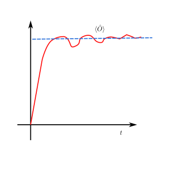
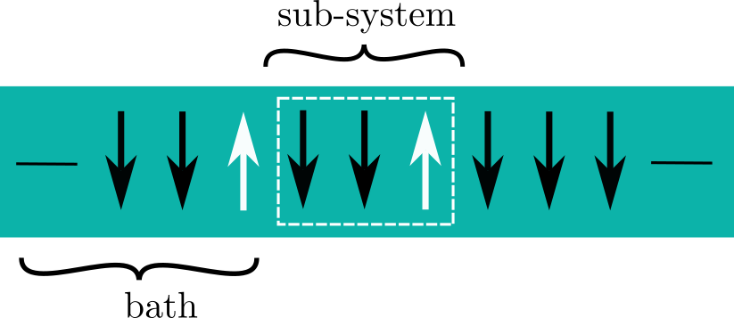

Lecture 3: Local relaxation and Random Matrix theory
====================================================              
#### Date: 2023-10-17              
              
Intro/ Recap:              
-------------              
[P] One of the crucial questions of this field is:

> How do quantum systems **relax** to **thermal** equililbrium ?

#### Ex: Observable

  

    Fig 1. Observable relaxing to equilibirium.

#### 1. Relaxation
States evolve according to time dependent Schroedinger equation.
We can solve this. The states just aquire a unitary transformation.

> $$ \vert \psi (t) \rangle = e^{-i\hat{H}t} \vert \psi \rangle $$

By solving typical eigenvalue problem for the Hamiltonian we can
expand this further as:

> $$  \vert \psi (t) \rangle = \sum_n \vert n \rangle \langle n \vert \psi (0) \rangle  e^{-iE_nt}$$
              
#### Two issues:
- This seems much more complicated than the picture layed out in example 1.
- The evolution is unitary, so no scrambling like in classical systems

### Observables

$$ \hat{O}  =  \vert p \rangle \langle q \vert  + \vert q \rangle \langle p \vert $$

(Not sure what his point was aobut this particualr observable)

Generic observable as a function of time:
$$ \langle O \rangle = \sum_{mn} c_n^* c_m O_{mn} e^{i(E_n - E_m) t} $$

We can split this up into a static and a dynamic part (assuming no degenerecies) 

$$  = \sum_n |c_n|^2O_{nn} + \sum_{m \ne n} c_n^* c_m e^{i(E_m - E_n)t} $$

This suggests there may be some sort of dephasing going on with the second term.
If we time average we are just left with the first term.

Clearly all the information about the dynamics is encoded in the eigenspectrum, but this is also too much information, so we need to see what we can extract that will be
generic. 

### Quantum systems relax locally

The crucial observation is that the wavefunction never relaxes to equilibrium. But we are only going to be measuring local quantites and quantum systems relax locally.
The full wavefunction dynamics may be **very** difficult. But locally the picuture
may be simpler.

$$ H = -J \sum_i \sigma_i^z \sigma_{i+1}^z $$

 

  

$$ \hat {O} = \hat{O}_A \otimes \hat{\mathbb{I}}_B$$

Main point if we trace over our density matrix we can show that:

$$ \langle \hat{O(t)} \rangle = Tr_A \left[\hat{O}_A \hat{\varrho}_A \right]$$

We want to find,  
$$ \lim_{t \rightarrow \infty } \lim_{L \rightarrow \infty} \{ \varrho_A \}$$

If this limit exists then we can start to say what we mean by relaxation and thermalisation e.g. if this density matrix goes to a thermal one.
The average above then becomes known as a diagonal ensemble average.

>n.b. order of limits matter here, taking small system and then large t we still give oscillations.
Should take large system and then long times? (Is this done in practice? )

### Thermalisation
We say a system thermalises is 

$$ \lim_{t \rightarrow \infty } \lim_{L \rightarrow \infty} \{ \varrho_A \}  
= Tr_B \left[  \varrho_{Gibbs}  \right]$$

where,

$$ \varrho_{Gibbs} = e^{-\beta \hat{H}} / Z, \qquad Z = Tr[e^{-\beta H}] = \sum_n e^{-\beta E_n}$$

We can use this to fix our inverse temperature.

$$ \frac{1}{Z} \sum_n E_n e^{-\beta E_n} = \langle \psi(t=0) \vert \hat {H} \vert \psi (t=0) \rangle $$

### Random matrix theory

#### Some observations: 
- #### Eigensates - Berry
Michael Berry makes observation that maybe we can treat wavefunction as random plane waves - some numerical evidence for this.

- #### Eigen values - Wigner
Second observation is Wigner-Dyson distribution. Calulate the level spacing and see rather than poissonian we get WD statistics from these highly complicated spectra.

### GOE

$$ M \in \mathbb{R} ^{\mathcal{D} \times \mathcal{D}} \qquad , M^T = M $$

$$ \mathcal(P)(M) \sim exp(-\frac{\mathcal{D}}{4} Tr[M^2]) $$

Can diagonalise $M$ as $\mathcal{P} $ is invariant under rotations

$$ \implies \mathcal{P}(M) = \prod_{mn} \exp(-\frac{\mathcal{D}}{4} M_{mn}^2) $$

### Eignestates ${\vert m \rangle, \vert n \rangle }$ in a basis $ \vert i \rangle $

> $$ \langle i \vert n \rangle = c_n ^2 $$

    Eignestates of random matrices look like random vectors that are normalised

$ \rightarrow c_n^i $ are iid. Gaussian variables.

    TODO: fill in some gaps here.

### Thermalisation

- Observale:
$$ \hat{O} = \sum_i O_i \vert i \rangle \langle i \vert $$

- Diagonal elements:
$$ O_{nn} = \langle n \vert O \vert n \rangle = \sum_{i=1}^\mathcal{D} O_i c_i^{n*}c_i^n = \sum O_i \frac{1}{\mathcal{D}}$$

$$ = \bar{O} \sim O(1)$$

n.b. last O is big O notation.

- Off diagonal:

    Go online for this 

- Fluctations

### Matrix Elements

Ansatz for matrix elements of a local observable: 
$$  O_{mn} = \bar{O}\delta_{mn} + \sqrt{\frac{\bar{O}^2}{\mathcal{D}}} \mathcal{R}_{mn} $$

$ \mathcal{R} $ is a Guassian random matrix

So now we can see,

$$ \langle \hat{O}(t) \rangle = \sum_n |c_n|^2 O_{mn} +
\sum_{m, n \ne m} c_n^* c_m O_{mn} e^{i(E_n - E_m)t} \\
= \bar{O}$$

### Wigner Surmise

#### Consider $ \mathcal{D} = 2 $

$$ M = (m_{11} ...) $$

$$  \mathcal{P}(M) \sim \exp(- \frac{1}{2} ( m_{11}^2 + ...))$$

Now we diagonalise M, 

$$  \rightarrow E_{\pm}  = \frac{M_{11} + M_{22}}{2} \pm 
\frac{1}{2} \sqrt{(M_{11} - M_{22})^2 + 4M_{12}^2}
$$

Want to introduce polar coordinates: 
$$ v = 2R \cos \theta , \lambda = R \sin \theta $$

Generally need alot of fining tuning to get degeneracies, which will not generally be present.

$$ \mathcal{P}(s) = \frac{s}{2}e^{-s^2/4} $$

Summary:              
--------              
so random matrix behaviour can lead to thermalisation but there was some stuff about infinite temperature stuff)
Next lecture will deal with ETH.
              
Todo:              
-----              
- Fill in the gaps that should have drawings and
work on a better way to get drawings in fast in the future
- Go over main section on random matrices
- Much tidying up to do here.
              

[previous](/lecture-notes/lecture_notes.2.md) &emsp;&emsp;&emsp;&emsp;&emsp;&emsp;&emsp;&emsp; [next](/lecture-notes/lecture_notes.4.md)