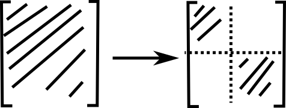
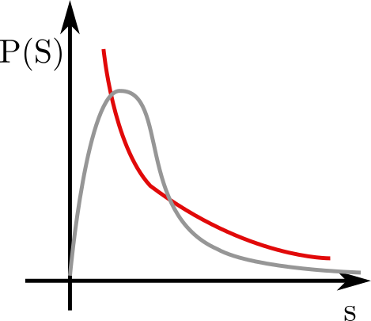
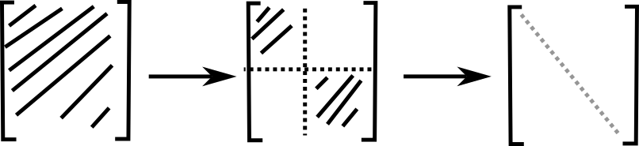

Lecture 5: Dynamics of Free Fermions               
====================================================              
#### Date: 2023-10-24              
              
Intro/ Recap:              
-------------              
To be contrasted with the dynamics of chaotic systems.
So far, we can use the randomness of the eigenstates of sufficiently
complicated Hamiltonians to get ETH and thermalisation.

Crucially the steady state of any thermodynamic system only depends on the energy.

#### What is the role of symmetry?

Given a symmetry where: $ [\hat{I}, \hat{H}] = 0$. 

**Ex**: total particle number, $ \hat{N} $, partiy $ \mathcal{P} $ etc.

From commutation we find:

$$ \langle I (t) \rangle = \langle I (0) \rangle  $$

And this really prevents thermalisation in the way we've seen so far, because if 
we look at the dynamcis of any observable we have the picture:

  

And the dotted blue line should be given by: $ Tr[\varrho_{Gibbs} I]$

which cannot occur for the obserables of conserved quantities.

### Eigenstates:

> $ [ H, I ] = 0 $

**Ex**: Parity operator $ \mathcal{P} $

$$   \mathcal{P} | i_1, i_2, ... \rangle
= |i_N, i_{N-1}, ..., i_1  \rangle $$

$$ [H, \mathcal{P}] = 0 ,\qquad  \mathcal{P}^2 = \mathbb{I} $$

Symmetries like this will block diagonalise the Hamiltonian which looks like:

  

### Level spacing statistics:

$ s_n = E_{n+1} - E_{n} $

  

Main point is that we can use ETH within the blocks.

### Free fermions.

What if we an extensive number of these conserved quantites.

Can end up with fully block diagonal form ie. have diagonalised the Hamiltonian via the symmetry basis. 

  

These are **integrable** systems.

- exact eigenstates
- exact dynamcis
- prove generalised $ \varrho_{Gibbs} $
- non generic!!!

#### Aspects of Fermionic creator/annihilation:

- site j : $ |0 \rangle _j , | 1 \rangle_j $
- $ c_j^{\dagger} | 0 \rangle_j = |1 \rangle _j $
etc.
- $ c_j ^2 = 0 $

- $ | 0 \rangle = \bigotimes_j |0 \rangle _j$

Important: fermionic operators anti-commute:
$$ \{ c_i, c_j^{\dagger} \} = \delta_{ij} $$

We now consider a lattice on which the fermions can 'hop'.
The Hamiltonian is given by:

> $$ \hat{H} = - J \sum_j c_j^{\dagger} c_{j+1} + h.c. - \mu \sum_j c_j^{\dagger} c_j
$$

Peridoic boundary conditions: $ c_{L+1} = c_1 $

#### Introduce momentum (motivated by periodicity ie. trans. invariance.)

take DFT of the operators which is unitary so:
$$
c(k) = \frac{1}{\sqrt{N}} \sum_j e^{ikj}c_j, \quad k = \frac{2\pi n}{L}, \quad n = 0, 1, ..., L-1
$$

and these operators also satisfy the commutation relations:
$$
\{ c(k), c^{\dagger}(q) \}= \delta_{kq} 
$$

> To be honest quite alot is missing here e.g. stone-von-neumann theorem or some proof of complete basis etc.

If we insert these operators into the Hamiltonian we get:
> $$
H = \sum_k [-2J \cos (k) - \mu] c^{\dagger}(k) c(k)
$$

ie. the Hamiltonian has now been diagonalised and can be written
in terms of the occupation number of fermions in each mode.

To write an eigenstate, we can just write a state with a set of fixed occupation numbers e.g.:
$$
|\{n_k \} \rangle = c_{k_1}^{\dagger}c_{k_2}^{\dagger}...c_{k_N}^{\dagger}|0 \rangle
$$

All of the occupation numbers commute with the Hamiltonian.
$$
[n_k, H] = [n_k, n_q] = 0, \quad \forall \; k, q
$$

$$
n_k = \frac{1}{L} \sum_{j,l} e^{-kl} c^{\dagger}_{j +l} c_j
$$

These are highly non-local.
- Equivalent set of loacl consserved quantities

$$
I^{n,+} = 2J\sum_k \cos(nk) \hat{n}_k
= J\sum_j(c_j^{\dagger}c_{j+n} + h.c.)
$$

$$
I^{n,-} = 2J\sum_k \sin(nk) \hat{n}_k
= iJ\sum_j(c_j^{\dagger}c_{j+n} - i h.c.)
** check this
$$

### Generalise Gibbs Ensemble (GGE)

>$$
\varrho_{GGE} = \frac{e^{-\sum_{n, \sigma} \lambda_{n, \sigma} I^{(n, \sigma)}}}
{Tr[e^{-\sum_{n, \sigma} \lambda_{n, \sigma} I^{(n, \sigma)}}]}
$$

>$$
= \frac{1}{Tr[Z]} e^{-\sum \mu_k \hat{n}(k)}
$$

The first of these  two is expresed in terms of
- physical quantities
- non trivial reduced density matrix.

The scond is more mathematically appealing and is written in terms of mode occupation numbers.

Basically we either think in terms of mode occupation numbers of in terms of the conserved charges.

### Thermalisation

Now we can show system will relax to GGE.
In a quantum quench I prepare system in ground state of Hamiltonian, I abruptly change one of the parameters and let the system evolve according to this new Hamiltonian.

Introducing Kitaev chain:

> $$ \hat{H} = - J \sum_j c_j^{\dagger} c_{j+1} + h.c. - \mu \sum_j c_j^{\dagger} c_j +
\Delta \sum_j (c_j^{\dagger}c_{j+1}^{\dagger} + 
c_{j+1}c_j)
$$

Still conservers momentum so now going to momentum space we have:

$$
H = \sum_k \varepsilon_0(k) n_k -i\Delta \sin (k) [c^{\dagger}(k)c^{\dagger} (-k) - c(-k) c(k)]
$$

Todo: go through and write in matrix form with vectors:
$$ \left[c(k)^{\dagger} \quad c(-k) \right]^{\dagger} $$

we get energies:
$
\pm \sqrt{\varepsilon_0(k)^2 + 4 \Delta^2 \sin^2(k)}
$

From the central Hamiltonian matrix $H$ which can be written in terms of the 2*2 Pauli matrices:
$$
H = \varepsilon_0(k) \sigma_x + 2\Delta \sin(k) \sigma_y
$$

Diagonlising this two by two matrix allows us to introduce "Bogoliubov fermions"

### coming back to the quench...

- groundstate = Bogoliubov vacuum:
    $ \alpha(k) | \tilde{0} \rangle = 0 $

Evolving the operators:
> $$
\frac{d}{dt} c(k; t) = i [H, c(k; t)] = i\varepsilon_0(k) [n(k), c(k;t)] = -i\varepsilon_0(k)c(k; t)
$$

So the annihilation operators just gain a phase under time evoluion.

$$
c(k; t) = e^{-i\varepsilon_0(k)t}c(k)
$$

$$
 = e^{-i\varepsilon_0(k)t} [
    \cos(\theta_{k/2}) \alpha(k) + i \sin(\theta_{k/2}) \alpha^{\dagger}(-k))
 ]
$$

We can now use this to calculate the dynamics under time evolution of the Kitaev chain.
              
$$
|\psi_0 \rangle = (c^{\dagger}_{k_1})^{n_1}(...)|0\rangle
$$

#### Two point functions:
$$
\langle \psi_0 | c^{\dagger}_k c_q | \psi_0 \rangle 
$$
$$
= ... 
$$
$$
= - \frac{i}{2} \delta_{k, -q} \sin(\theta_k) e^{+2i\varepsilon_0(k)t}
$$

This lays some of the ground work we will need for the next lecture where some interesting physics and interpretations can be made.

Summary:              
--------              
We consider the Kitaev chain as an exactly solvable model that we can analyse the dynamics of analytically after a quantum quench and see if we get thermal quantities according the generalised Gibbs ensemble.
              
Todo:              
-----              
- Do the diagonalisation of the Kitaev chain
- Go over the results on the level spacing
              
[previous](/lecture-notes/lecture_notes.4.md) &emsp;&emsp;&emsp;&emsp;&emsp;&emsp;&emsp;&emsp; [next](/lecture-notes/lecture_notes.6.md)             