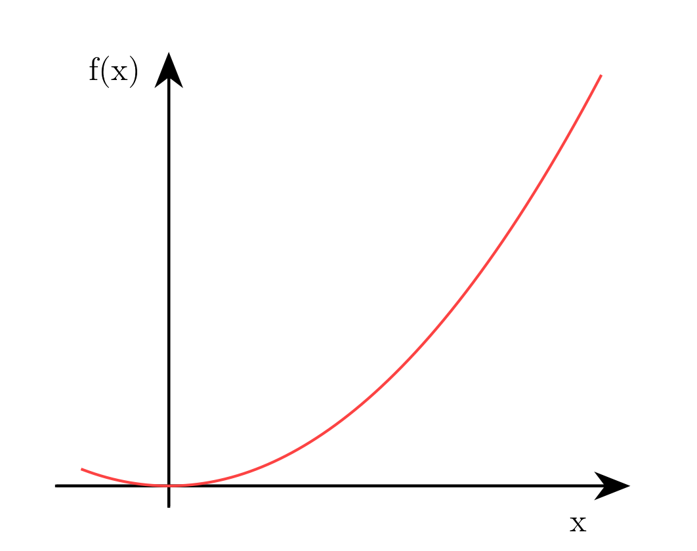

Lecture 2: Quantum many body dynamics              
====================================================              
#### Date: 2023-10-11              
        
              
## This is a sub heading 
> Testing for $ \LaTeX $

with **Bold** and *italics*

> $$ \hat{H} = \sum_{\langle i, j \rangle} -t \; \hat{c}_i^\dagger \hat{c}_j $$
A simple hopping hamiltonian
              
Summary:              
--------              

    Fig 1: An image showing a graph

  

Some more text about this stuff.
              
Todo:              
-----              
              
Ref:              
----